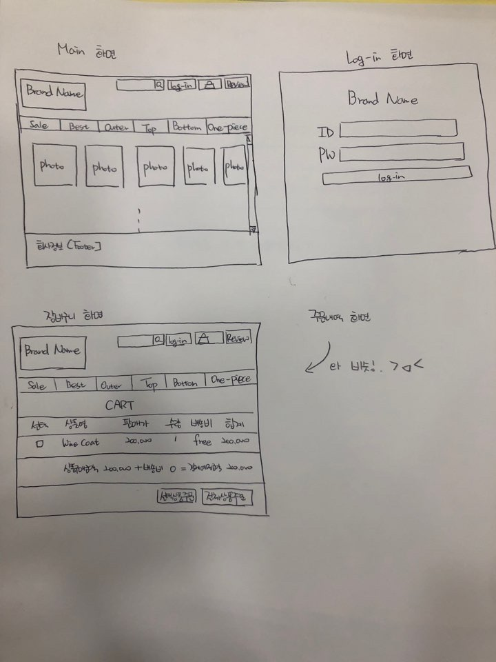

# FDS 중간 프로젝트 : 쇼핑몰 제작

## 작업예상일정
---
- 181107 (Wed) 12:00
  기획 완성

- 181107 (Wed)

  시멘틱한 HTML 메인화면 구조설계 및 로그인 기능 구현

- 181108 (Thu)

  상품 데이터 입력 및 상품 목록구현, 제품 상세 페이지 구현

- 181109 (Fri)

  장바구니 화면, 주문내역 구현

- 181110 (Sat)

  부족한 부분 수정 (작업하면서 업데이트 예정)

- 181111 (Sun)

  부족한 부분 수정 (작업하면서 업데이트 예정)

## 초기 기획안
---

이렇게 만들수 있겠죠?? 제발 ㅠㅠㅠ

## 목표
---
최소 요구 기능만큼은 필수로 버그 없이 돌아가게 만들자 ! 화이팅 ! >_<

---

이 저장소를 중간 프로젝트에서 템플릿으로 사용할 수 있습니다. 빌드 도구로 [Parcel](https://parceljs.org/)을 사용하고 있으며, [create-react-app](https://github.com/facebook/create-react-app)에서 사용하는 [Babel](http://babeljs.io/) 프리셋인 [babel-preset-react-app](https://github.com/facebook/create-react-app/tree/master/packages/babel-preset-react-app)을 통해 여러 최신 문법을 사용할 수 있도록 설정되어 있습니다.

개발을 시작하기 전, [개발 가이드](./guide.md)를 읽어보세요.

## npm 명령

- `npm install` - 프로젝트 실행에 필요한 파일을 설치하는 명령. 프로젝틑 최초 실행 시 반드시 실행해주어야 합니다.
- `npm start` - 개발용 서버를 실행시키는 명령
- `npm run build` - Netlify 등의 호스팅 서비스에서 사용할 수 있는 HTML, CSS, JS 파일을 생성해주는 명령. `dist` 폴더에 파일이 생성됩니다.

## 저장소 복사하기

**Github의 fork 기능으로는 계정 당 저장소 하나밖에 복사하지 못합니다.** Fork 기능을 사용하지 않고 프로젝트를 복사하려면, 아래의 절차대로 해 주세요.

1. 복사하고 싶은 저장소를 `git clone` 명령을 사용해 내려받는다.
1. 내려받은 폴더로 이동한 후, `rm -rf .git` 명령을 실행한다.
1. `git init`, `git add .`, `git commit -m "..."` 명령을 차례로 실행한다. (저장소 초기화)
1. Github에서 새 저장소를 만든 후, 위에서 초기화한 저장소를 푸시한다.
